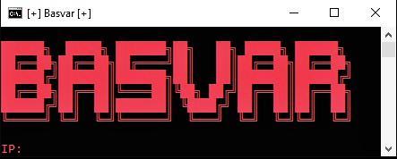
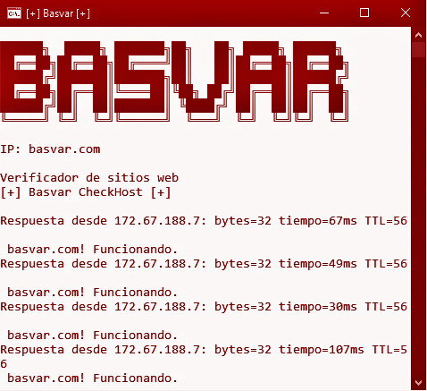

# Pinger

Una herramienta personalizada del comando **Ping** en **Windows**.

Esta herramienta es facil de utilizar, solo tenemos que escribir la **IP** o **Dominio** del sitio web a verificar el estado.

¿Cómo funciona?
======
Solo tendremos que agregar la IP o en su defecto un Dominio a verificar el estado:

Una vez puesta la direccion ip o el dominio solo basta con darle **Enter** y el codigo empezara a funcionar:

Creador
======
Basvar, inc

basvar.com

contacto@basvar.com